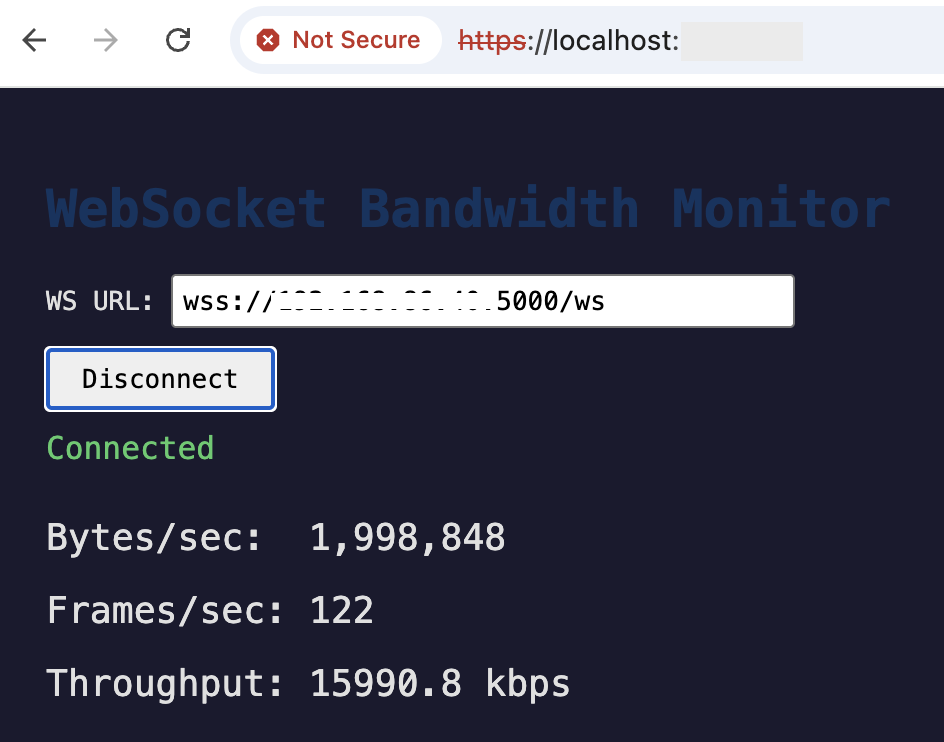
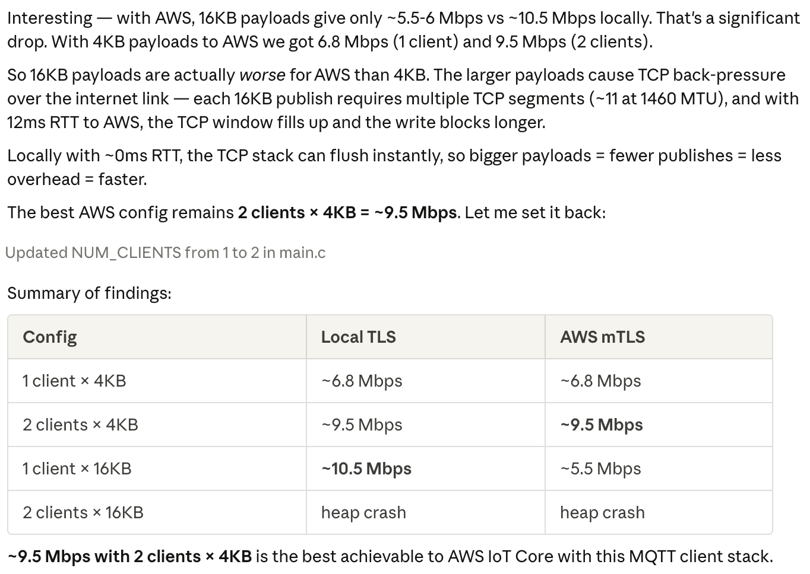

# Benchmark ESP32-S3 Web stack, from sockets to secure websockets

We use PlatformIO and tune sdkconfig for every level. You will find incremental commits for the various socket types.

TL;DR


|**Protocol / Stack**|**Available Bandwidth (After Optimizations)**|**Key Optimizations**|
|---|---|---|
|**Raw Sockets (TCP)**|**~25 to 30 Mbps**|• Increased TCP send buffer from 16KB to 32KB<br>• Bumped `sdkconfig` limits significantly (TCP send buffer/receive window to ~65KB, lwIP internal mailbox, AMPDU block-ack window)<br>• Removed `TCP_NODELAY` to allow Nagle's algorithm to batch partial segments|
|**WebSockets (WS)**|**~25 to 27 Mbps**|• Increased send buffer size from 4KB to 16KB<br>• Larger frames drastically reduced the proportional overhead of WebSocket framing headers and masking|
|**Secure WebSockets (WSS / TLS)**|**~15 to 16 Mbps**|• Increased mbedTLS output buffer from 4KB to 16KB to prevent heavy fragmentation<br>• Adjusted cipher suites to fully utilize hardware-accelerated AES-CBC/GCM|
|**MQTT on AWS (over TLS)**|**~9.5 to 10 Mbps**|• Bumped CPU clock speed from 160 MHz to 240 MHz<br>• Increased payloads to 8KB to align efficiently with TLS records<br>• Pinned MQTT publish task to Core 1 to avoid competing with WiFi interrupts<br>• Enabled hardware-accelerated GCM ciphers to reduce HMAC overhead<br>• Spawned 2 independent MQTT clients in parallel|

## Sockets

### Initial Performance

```
Connecting to 192.168.86.40:5000...
Connected!
0.04 MB/s (0.29 Mbps)
0.09 MB/s (0.69 Mbps)
0.02 MB/s (0.13 Mbps)
0.07 MB/s (0.57 Mbps)
0.09 MB/s (0.69 Mbps)
0.02 MB/s (0.18 Mbps)
0.06 MB/s (0.47 Mbps)
0.08 MB/s (0.63 Mbps)
0.08 MB/s (0.63 Mbps)
```

### Improvements

Here's what was changed and why:

**sdkconfig (the big win):**
- `TCP_SND_BUF_DEFAULT`: 5760 → 65534 — TCP send buffer was only ~4 MSS segments, now ~45
- `TCP_WND_DEFAULT`: 5760 → 65534 — TCP receive window was tiny, limiting how much unacknowledged data can be in flight
- `TCP_RECVMBOX_SIZE`: 6 → 64 — lwIP internal mailbox was too small
- `TCP_OOSEQ_MAX_PBUFS`: 4 → 8 — more out-of-order buffering to handle WiFi packet reordering
- `WIFI_TX_BA_WIN` / `WIFI_RX_BA_WIN`: 6 → 16 — AMPDU block-ack window, allows more WiFi frames in flight

**Code:**
- Send buffer bumped from 16KB to 32KB
- Socket SO_SNDBUF bumped to 65534
- Removed `TCP_NODELAY` — Nagle is actually helpful for bulk streaming (batches partial segments)

Rebuild and reflash. You should see a significant improvement — expect ~5-15 Mbps depending on WiFi conditions.

### Improved Configuration

```
Connecting to 192.168.86.40:5000...
Connected!
3.35 MB/s (26.79 Mbps)
3.26 MB/s (26.06 Mbps)
3.60 MB/s (28.83 Mbps)
3.11 MB/s (24.89 Mbps)
3.52 MB/s (28.14 Mbps)
3.50 MB/s (27.98 Mbps)
3.77 MB/s (30.19 Mbps)
```

### Comment

Nice! ~28 Mbps is excellent for ESP32-S3 over WiFi — that's close to the practical maximum for TCP over 802.11n. The TCP buffer tuning made a ~40x improvement.

## Websockets

### Initial build

```
% cargo run -- "ws://192.168.86.40:5000/ws"
    Finished `dev` profile [unoptimized + debuginfo] target(s) in 0.10s
     Running `target/debug/socket-bandwidth 'ws://192.168.86.40:5000/ws'`
Connecting to ws://192.168.86.40:5000/ws...
Connected!
2.31 MB/s (18.47 Mbps)
2.35 MB/s (18.81 Mbps)
2.33 MB/s (18.65 Mbps)
2.23 MB/s (17.88 Mbps)
1.65 MB/s (13.21 Mbps)
1.99 MB/s (15.88 Mbps)
```

### Improvements

Increased `SEND_BUF_SIZE` from 4096 to 16384. With 4KB frames, the WebSocket framing overhead (2-14 bytes per frame + masking) is proportionally large. At 16KB per frame, it's much less significant.

That said, ~18 Mbps is roughly what to expect with WebSocket on ESP32-S3 over WiFi. The raw TCP version likely got more because:
- No per-message framing overhead (WebSocket adds header bytes per frame)
- No HTTP server layer in the middle (the `esp_http_server` adds processing)
- Raw TCP can use larger send buffers (32KB) and the kernel handles segmentation

WebSocket will always be slower than raw TCP — it's the cost of the protocol. The 16KB buffer should help get a few more Mbps though.

### Final build

```
% cargo run -- "ws://192.168.86.40:5000/ws"
    Finished `dev` profile [unoptimized + debuginfo] target(s) in 0.08s
     Running `target/debug/socket-bandwidth 'ws://192.168.86.40:5000/ws'`
Connecting to ws://192.168.86.40:5000/ws...
Connected!
3.14 MB/s (25.09 Mbps)
3.33 MB/s (26.68 Mbps)
3.31 MB/s (26.52 Mbps)
2.58 MB/s (20.63 Mbps)
2.85 MB/s (22.79 Mbps)
3.38 MB/s (27.01 Mbps)
3.38 MB/s (27.03 Mbps)
3.16 MB/s (25.26 Mbps)
```

## Secure Websockets

Based on [this benchmark](https://www.oryx-embedded.com/benchmark/espressif/crypto-esp32-s3.html)...

* AES-GCM is software-only on ESP32-S3: ~1.35 MB/s — that matches closely with your ECDSA result (~0.03-0.08 MB/s was likely ECDSA + software AES-GCM overhead)
* AES-CBC has hardware acceleration: ~7-8 MB/s — which matches your RSA result (~8 Mbps = ~1 MB/s... wait, you're getting 1 MB/s = 8 Mbps)

~8 Mbps with RSA is actually hitting the AES-GCM software ceiling (~1.35 MB/s ≈ ~10.8 Mbps theoretical max). To get better throughput, we should force AES-CBC cipher suites which have hardware acceleration.

### Initial

```
% cargo run -- "wss://192.168.86.40:5000/ws"
    Finished `dev` profile [unoptimized + debuginfo] target(s) in 0.12s
     Running `target/debug/socket-bandwidth 'wss://192.168.86.40:5000/ws'`
Connecting to wss://192.168.86.40:5000/ws...
Connected!
0.70 MB/s (5.57 Mbps)
0.71 MB/s (5.64 Mbps)
0.70 MB/s (5.61 Mbps)
0.72 MB/s (5.77 Mbps)
0.70 MB/s (5.61 Mbps)
0.72 MB/s (5.80 Mbps)
0.71 MB/s (5.66 Mbps)
0.71 MB/s (5.70 Mbps)
0.71 MB/s (5.68 Mbps)
```

### Improvements

Increase mbedTLS output buffer — the sdkconfig has CONFIG_MBEDTLS_SSL_OUT_CONTENT_LEN=4096. Increasing this to 16384 would allow larger TLS records per send.
Want me to bump the mbedTLS output buffer size? That's likely the biggest bottleneck — each send is being fragmented into 4KB TLS records. Symmetric 16KB buffers — no overhead from asymmetric path handling.

### Final Build

```
% cargo run -- "wss://192.168.86.40:5000/ws"
    Finished `dev` profile [unoptimized + debuginfo] target(s) in 0.13s
     Running `target/debug/socket-bandwidth 'wss://192.168.86.40:5000/ws'`
Connecting to wss://192.168.86.40:5000/ws...
Connected!
1.97 MB/s (15.72 Mbps)
1.97 MB/s (15.75 Mbps)
1.97 MB/s (15.77 Mbps)
1.92 MB/s (15.39 Mbps)
2.05 MB/s (16.44 Mbps)
2.00 MB/s (16.02 Mbps)
1.86 MB/s (14.88 Mbps)
2.06 MB/s (16.47 Mbps)
2.08 MB/s (16.67 Mbps)
```

### Comment

~16 Mbps — roughly 2x improvement from hardware AES-CBC. That's close to the benchmark's ~7-8 MB/s raw AES-CBC throughput minus the TLS record framing, WebSocket framing, and TCP overhead.

### From Browser

Gives similar performance on a browser if one can deal with the certificates




## MQTT on AWS

### Setup

```
# 1. Deploy the stack
aws cloudformation create-stack --stack-name iot-mqtt --template-body file://aws/iot-core.yaml

# 2. Create device certs
aws iot create-keys-and-certificate --set-as-active \
  --certificate-pem-outfile device.cert.pem \
  --public-key-outfile device.public.key \
  --private-key-outfile device.private.key

# 3. Attach policy & thing (use cert ARN from step 2)
aws iot attach-policy --policy-name esp32-blast-policy --target <CERT_ARN>
aws iot attach-thing-principal --thing-name esp32-blast --principal <CERT_ARN>

# 4. Get Root CA + endpoint
curl -o AmazonRootCA1.pem https://www.amazontrust.com/repository/AmazonRootCA1.pem
aws iot describe-endpoint --endpoint-type iot:Data-ATS

# 5. Convert to C headers
cp AmazonRootCA1.pem AmazonRootCA1_tmp.pem && printf '\0' >> AmazonRootCA1_tmp.pem && xxd -i AmazonRootCA1_tmp.pem | sed 's/AmazonRootCA1_tmp_pem/AmazonRootCA1_pem/g' > esp/src/cert_data.h && rm AmazonRootCA1_tmp.pem

cp device.private.key device_private_tmp.key && printf '\0' >> device_private_tmp.key && xxd -i device_private_tmp.key | sed 's/device_private_tmp_key/device_private_key/g' > esp/src/key_data.h && rm device_private_tmp.key

cp device.cert.pem device_cert_tmp.pem && printf '\0' >> device_cert_tmp.pem && xxd -i device_cert_tmp.pem | sed 's/device_cert_tmp_pem/device_cert_pem/g' > esp/src/client_cert_data.h && rm device_cert_tmp.pem

# 6. Update MQTT_BROKER_URI in main.c with your endpoint
```

### Initial

```

--- Quit: Ctrl+C | Menu: Ctrl+T | Help: Ctrl+T followed by Ctrl+H
I (2697) mqtt_blast: Throughput: 0.0 kbps | 0 msgs/s | 0 bytes/s | 0 errors | heap: 191164␛[0m
I (2917) mqtt_blast: MQTT connected to AWS IoT Core␛[0m
I (2997) mqtt_blast: Starting MQTT blast with 4096 byte payloads (QoS 0)...␛[0m
I (3697) mqtt_blast: Throughput: 5079.0 kbps | 155 msgs/s | 634880 bytes/s | 0 errors | heap: 145748␛[0m
I (4697) mqtt_blast: Throughput: 7143.4 kbps | 218 msgs/s | 892928 bytes/s | 0 errors | heap: 178636␛[0m
I (5707) mqtt_blast: Throughput: 7176.2 kbps | 219 msgs/s | 897024 bytes/s | 0 errors | heap: 177068␛[0m
I (6727) mqtt_blast: Throughput: 7307.3 kbps | 223 msgs/s | 913408 bytes/s | 0 errors | heap: 177088␛[0m
I (7757) mqtt_blast: Throughput: 7110.7 kbps | 217 msgs/s | 888832 bytes/s | 0 errors | heap: 180216␛[0m
I (8757) mqtt_blast: Throughput: 7143.4 kbps | 218 msgs/s | 892928 bytes/s | 0 errors | heap: 173760␛[0m
I (9757) mqtt_blast: Throughput: 7274.5 kbps | 222 msgs/s | 909312 bytes/s | 0 errors | heap: 175160␛[0m
I (10757) mqtt_blast: Throughput: 7012.4 kbps | 214 msgs/s | 876544 bytes/s | 0 errors | heap: 174024␛[0m
```

### Improvements

* Payload: 4KB → 8KB — matches CONFIG_MBEDTLS_SSL_MAX_CONTENT_LEN=16384, so each publish fills exactly half TLS record. At 4KB you were paying TLS framing overhead 4x more often.
* Batch 4 publishes per yield — reduces context-switch overhead; if back-pressure hits, breaks out immediately
* Outbox limit 64KB — enough buffer to keep data flowing without exhausting RAM
* Pinned blast task to core 1 (xTaskCreatePinnedToCore) — the ESP32-S3 is dual-core. Core 0 handles WiFi interrupts; by pinning the blast loop to core 1, they don't compete.
* Deleted idle main task — vTaskDelete(NULL) frees the stack instead of wasting cycles in a sleep loop.
* Enabled GCM cipher (CONFIG_MBEDTLS_GCM_C=y): Without this, TLS was forced to use CBC mode which is inherently sequential (each block depends on the previous). GCM (Galois Counter Mode) can be parallelized and is what AWS IoT Core prefers. The ESP32-S3 has hardware AES acceleration that works with both, but GCM has less overhead (no separate HMAC step).
* CPU 160 MHz → 240 MHz: A free 50% clock speed increase. Both CONFIG_ESP_DEFAULT_CPU_FREQ_MHZ and CONFIG_ESP32S3_DEFAULT_CPU_FREQ_MHZ were set to 160.
* [Added and then removed] Outbox limit set — prevents unbounded memory growth when publishing faster than the network can drain.
The 16KB outbox limit was causing the periodic stalls (0 kbps drops) — the outbox would fill, publishes would fail, then it had to drain before resuming.
* aws/iot-core.yaml — Connect resource changed from client/${ThingName} to client/${ThingName}-* so multiple client IDs are allowed.
* Spawns NUM_CLIENTS=2 independent MQTT clients. There wasn't enough heap for 3 clients

### After improvements

#### QoS level 0

```
--- Quit: Ctrl+C | Menu: Ctrl+T | Help: Ctrl+T followed by Ctrl+H
I (2739) mqtt_blast: Client 0: MQTT connected
I (2929) mqtt_blast: Client 0: Starting blast, 4096 byte payloads, QoS 0
I (3339) mqtt_blast: Client 1: MQTT connected
I (3389) mqtt_blast: Client 1: Starting blast, 4096 byte payloads, QoS 0
[MQTT 2 clients] 5.44 Mbps | 166 msgs/s | 679936 bytes/s | 0 errors | heap: 100996
[MQTT 2 clients] 9.67 Mbps | 295 msgs/s | 1208320 bytes/s | 0 errors | heap: 95592
[MQTT 2 clients] 9.90 Mbps | 302 msgs/s | 1236992 bytes/s | 0 errors | heap: 108548
[MQTT 2 clients] 9.80 Mbps | 299 msgs/s | 1224704 bytes/s | 0 errors | heap: 102284
[MQTT 2 clients] 9.60 Mbps | 293 msgs/s | 1200128 bytes/s | 0 errors | heap: 103972
[MQTT 2 clients] 9.86 Mbps | 301 msgs/s | 1232896 bytes/s | 0 errors | heap: 102056
[MQTT 2 clients] 9.83 Mbps | 300 msgs/s | 1228800 bytes/s | 0 errors | heap: 94524
[MQTT 2 clients] 9.93 Mbps | 303 msgs/s | 1241088 bytes/s | 0 errors | heap: 105488
[MQTT 2 clients] 9.44 Mbps | 288 msgs/s | 1179648 bytes/s | 0 errors | heap: 106852
[MQTT 2 clients] 8.22 Mbps | 251 msgs/s | 1028096 bytes/s | 0 errors | heap: 32096
[MQTT 2 clients] 8.06 Mbps | 246 msgs/s | 1007616 bytes/s | 0 errors | heap: 102320
[MQTT 2 clients] 9.70 Mbps | 296 msgs/s | 1212416 bytes/s | 0 errors | heap: 99224
[MQTT 2 clients] 9.63 Mbps | 294 msgs/s | 1204224 bytes/s | 0 errors | heap: 110112
```

#### QoS level 1

Notice the "errors". They are actually retries.

```
[MQTT 2 clients] 0.79 Mbps | 24 msgs/s | 98304 bytes/s | 10 errors | heap: 87260
[MQTT 2 clients] 1.38 Mbps | 42 msgs/s | 172032 bytes/s | 19 errors | heap: 65864
[MQTT 2 clients] 1.28 Mbps | 39 msgs/s | 159744 bytes/s | 18 errors | heap: 85384
[MQTT 2 clients] 1.31 Mbps | 40 msgs/s | 163840 bytes/s | 18 errors | heap: 110988
[MQTT 2 clients] 1.44 Mbps | 44 msgs/s | 180224 bytes/s | 18 errors | heap: 111436
[MQTT 2 clients] 1.38 Mbps | 42 msgs/s | 172032 bytes/s | 20 errors | heap: 62988
[MQTT 2 clients] 1.57 Mbps | 48 msgs/s | 196608 bytes/s | 18 errors | heap: 74668
[MQTT 2 clients] 1.44 Mbps | 44 msgs/s | 180224 bytes/s | 18 errors | heap: 76472
[MQTT 2 clients] 1.34 Mbps | 41 msgs/s | 167936 bytes/s | 19 errors | heap: 75032
```

### Comments

TLS local: ~9.5 Mbps (TLS record buffering decouples publishes from socket writes)
TLS AWS: ~9.5 Mbps (same ceiling — RTT doesn't matter because TLS buffering hides it)

MQTT publish overhead: The esp_mqtt_client runs a single internal task that processes an outbox queue — it serializes all publishes through one task with mutex locks, select() loops, and event dispatching between each write. So it's not that MQTT is more "chatty" on the wire — the framing overhead is negligible at 4KB payloads. It's the software architecture: outbox queue → single task dequeue → mutex lock → write → unlock → loop, vs direct socket write in the caller's context.

We also compared with local TLS and we got a slightly different bottleneck/profile, but still in the same ballpark.



